# Celebrity Doppelganger

Upload a photo or take a live selfie, and find your three closest celebrity lookalikes among **139,845 face photos of 36,310 celebrities**.

**Live demo: [celebrity-doppelganger.vercel.app](https://celebrity-doppelganger.vercel.app)** (free hosting, so the first request after a quiet spell takes ~20 s while the model wakes up)

<p align="center">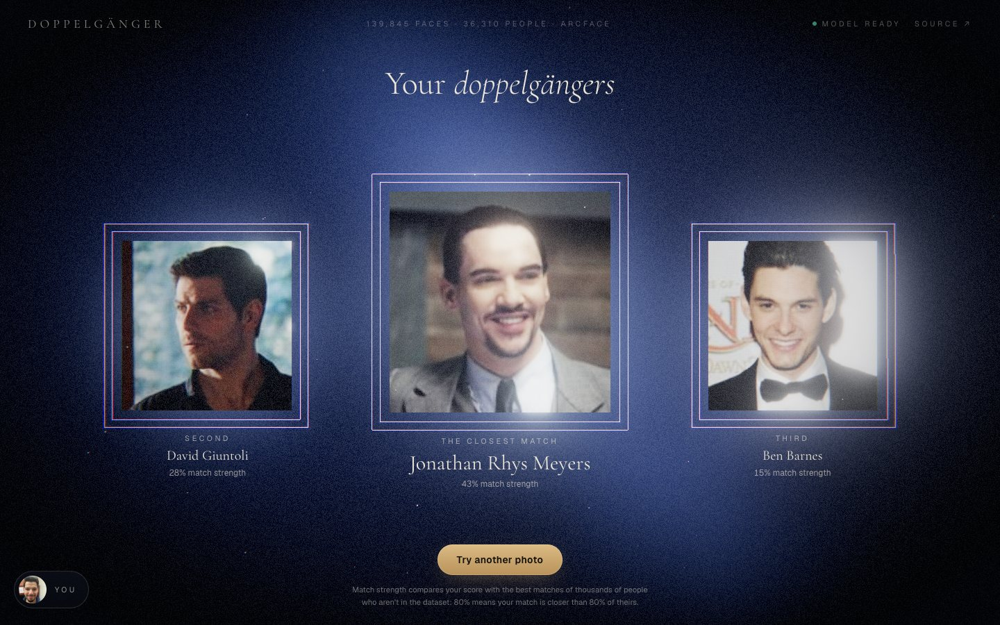</p>

The app detects the face, embeds it with ArcFace, and runs a cosine search over the index. The score is shown as a **match strength**: a percentile calibrated against how well thousands of people who *aren't* celebrities match.

**The interface is a short film:**
- **Landing:** a head made of 16,000 points of light turns to follow your cursor.
- **On Find:** it disperses past the camera, and you glide through a gallery of light (portraits drawn in dots, floating in the dark) while the search runs.
- **The ending:** a cloud of particles assembles into your three matches, each point coloured from its photo, and the real photos resolve inside frames of light.

| | | |
|---|---|---|
| 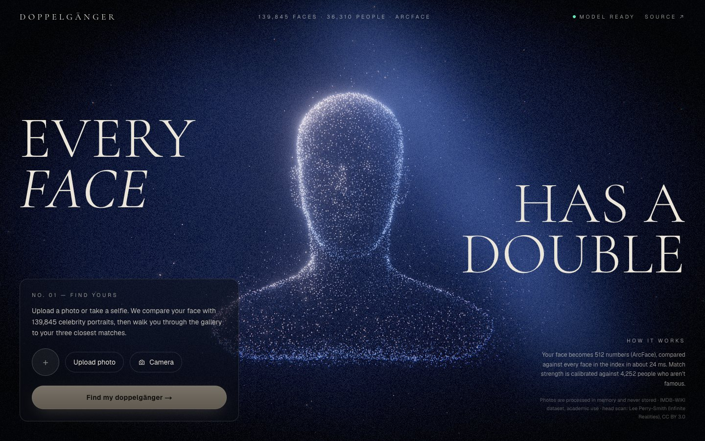 | 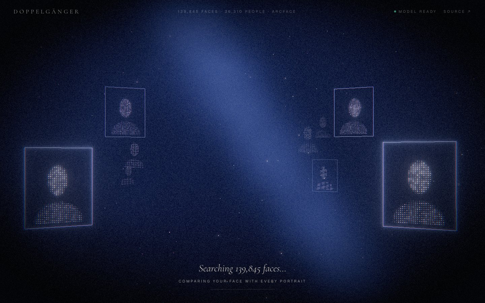 | 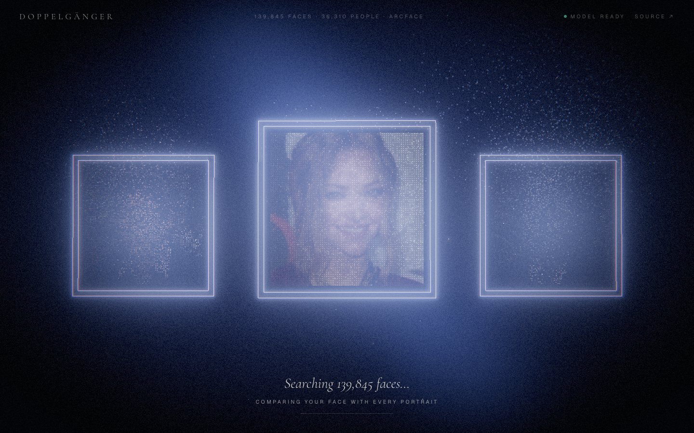 |

It's built in plain three.js (`frontend/app/experience/`), with a custom shader per element and a bloom, grain and vignette pass. It runs at 60 fps, loads after the page is usable, and has fallbacks for phones, reduced motion and browsers without WebGL.

What's in the repo:
- **ML pipeline:** embedding 277k IMDB-WIKI photos on a rented GPU, duplicate and label-noise cleanup, leave-one-out retrieval evaluation, and score calibration against a real-face null distribution.
- **Serving:** a FastAPI backend with Prometheus metrics and a Next.js 16 frontend with live camera capture.
- **Infrastructure:** Terraform (GKE and AKS), a Helm chart, keyless cloud auth with workload identity, HPA autoscaling, a k6 load test, Grafana dashboards, and keyless CI/CD from GitHub Actions.

## Architecture

```
 Browser ──► Next.js 16 ──/api/match proxy──► FastAPI backend
 resize ≤1024px, camera   adds X-API-Key      SCRFD detect → ArcFace 512-d embedding
                                              → cosine top-k over 139,845 faces (name-deduped)
                                              → percentile calibration → 3 matches + thumbnails

 Free tier (always on, ₹0):   Vercel (frontend) + Modal (serverless backend, scales to zero)
 Full deployment (Kubernetes): Terraform → GKE · Artifact Registry · private GCS bucket · Workload Identity
                               Helm → ingress-nginx + Let's Encrypt TLS · HPA · ServiceMonitor → Grafana
                               GitHub Actions → Workload Identity Federation → Cloud Build → helm upgrade
```

The same Helm chart runs on a local kind cluster, on AKS (`infra/azure/`) and on GKE (`infra/terraform/`).

## Results

**Data pipeline** (IMDB-WIKI):

| Stage | Faces | Notes |
|---|---|---|
| Embedded | 277,752 | Detections scoring below 0.75 dropped (threshold chosen from evidence, `scripts/test_det_score.py`) |
| Byte-duplicate cleanup | 150,720 | 45.7% of rows were identical images filed under several names (IMDb stills credited to every co-star) |
| Label-noise cleanup | **139,845** | 65 junk wiki "User:" pages, 9,815 photos inconsistent with their identity's other photos, 995 from pairs that disagreed |

**Retrieval accuracy** (`scripts/evaluate_retrieval.py`): hold out one photo each for 2,000 celebrities with 2 or more photos, search with it, and check whether the true person appears in the top-k distinct names.

| Index | Top-1 | Top-5 | Top-10 |
|---|---|---|---|
| Before label cleanup (150,720) | 87.5% | 89.2% | 89.3% |
| After label cleanup (139,845) | 98.7% | 99.9% | 100% |

The two rows bracket the true accuracy:
- **"Before" is a lower bound.** About 10% of those queries are mislabeled photos, which can't retrieve their "own" name.
- **"After" is an upper bound.** The cleanup removed photos that disagreed with their identity, which also removes hard-but-correct queries.

**Score calibration** (`scripts/calibrate_real_faces.py`): match strength is the percentile of your best score among the best scores of **4,252 ordinary people** (FFHQ Flickr portraits, not celebrities), run through the same detection and embedding pipeline.

| Baseline for "a typical best match" | p5 | median | p95 |
|---|---|---|---|
| Ordinary people (FFHQ), **served** | 0.247 | 0.284 | 0.342 |
| Other celebrity crops from the index (`build_calibration.py`) | 0.269 | 0.313 | 0.392 |

Why it changed twice:
- The first version mapped raw scores through 10 hand-picked lookalike pairs, so chance-level matches showed as "45–75% similar".
- Calibrating against other celebrity crops overcorrected. Real uploads score lower than in-domain queries, so the 5 test selfies showed only 1–39%.
- Against ordinary people they score 8–75%, averaging 46%, which is what an honest calibration should give random people. Resolution isn't the cause: the same photo scores within 0.01 at 256 px and at 1024 px.

**Latency:**
- Search: ~24 ms over 139,845 faces with brute-force numpy on CPU. At this size FAISS isn't needed.
- Embedding: ~0.55 s per image on CPU and ~0.011 s on an RTX 3060 Ti. The full dataset was embedded on a rented Vast.ai GPU (`notebooks/`).

**Under load** (k6 in-cluster, 8 concurrent uploads for 3 minutes, GKE e2-standard-4 nodes):

| Requests | Failed | p50 | p95 | Autoscaling |
|---|---|---|---|---|
| 1,056 | **0%** | 0.77 s | **1.32 s** | HPA scaled the backend 1 → 2 pods when CPU passed 60% |

## Full deployment on Kubernetes

The whole stack goes up and comes down with one command each (`infra/session/up-gcp.sh` and `down-gcp.sh`). It was run end to end on GKE, together with the [churn platform](https://github.com/agrimsharma/saas-churn-platform) in the same cluster, and then torn down.

| | |
|---|---|
| 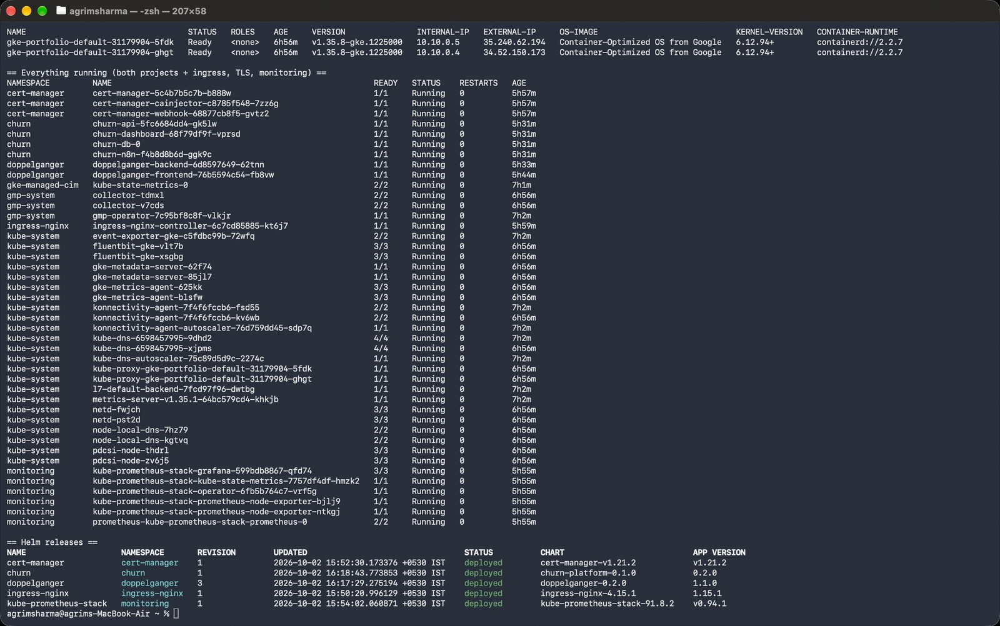 | 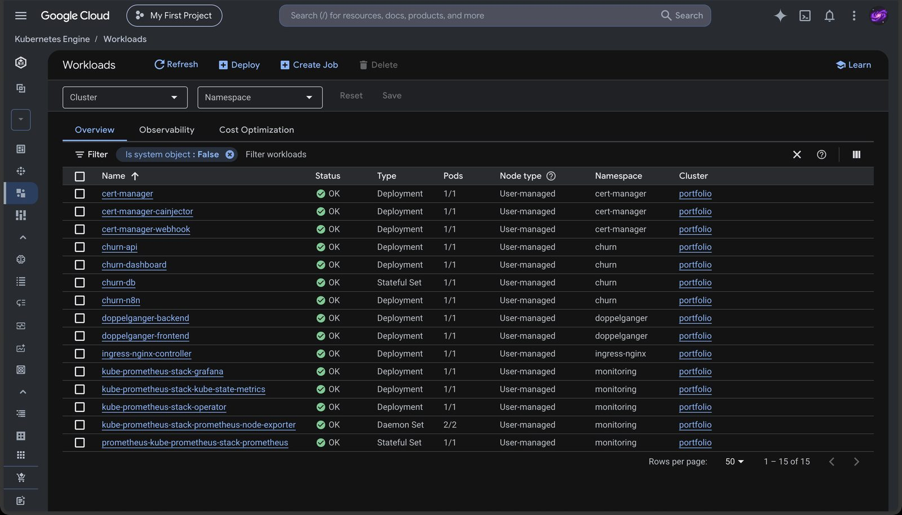 |
| **Infrastructure as code:** Terraform creates the cluster, registry, private bucket, service accounts and GitHub federation; Helm installs ingress-nginx, cert-manager, kube-prometheus-stack and both apps. | **15 workloads** across both projects, all healthy. |
| 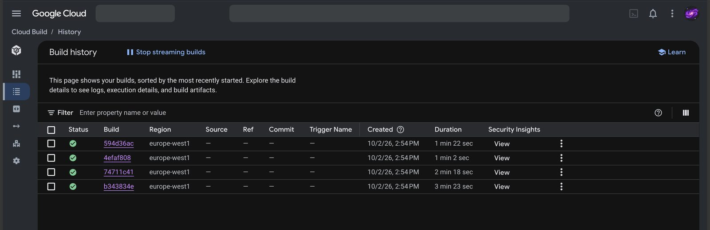 | 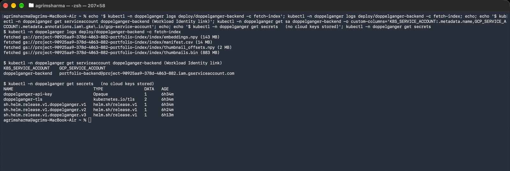 |
| **4 images built in parallel** on Cloud Build (amd64, from an arm64 Mac). | **No keys anywhere:** an init container pulls the 1 GB index from a private bucket using the pod's Kubernetes service account, mapped to a Google service account through Workload Identity. The only secrets are the app's API key and the TLS cert. |

**Autoscaling under load**: k6 runs as a Job inside the cluster, so a home connection isn't the bottleneck.

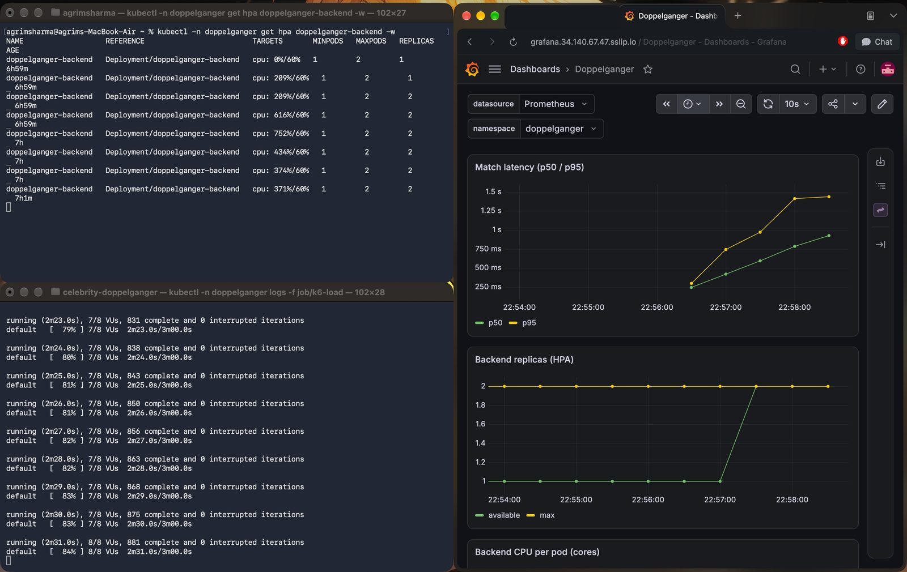

<details><summary>k6 summary</summary>

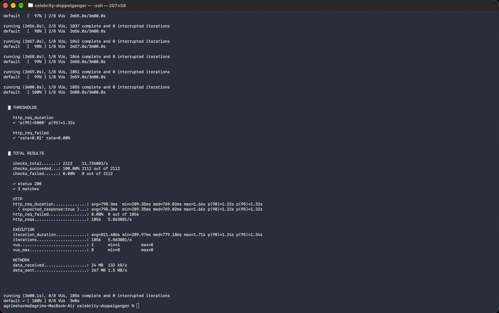
</details>

**CI/CD: push to `main`, live 7 minutes later.** `deploy-gke.yml` logs in to GCP through Workload Identity Federation (no stored key), builds both images on Cloud Build and runs `helm upgrade`. Kubernetes swaps the pods with a rolling update, so the site doesn't go down.

| | |
|---|---|
| 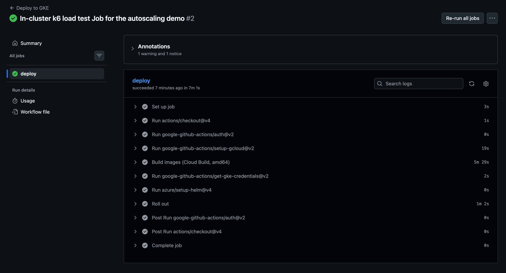 | 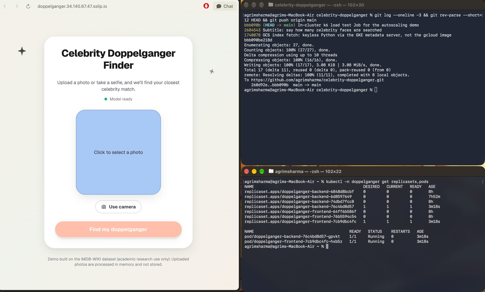 |
| The pipeline run: 5m 29s building, 1m 2s rolling out. | The push (top) and Kubernetes' record of the rollout (bottom): old ReplicaSets at 0, new ones at 1. |

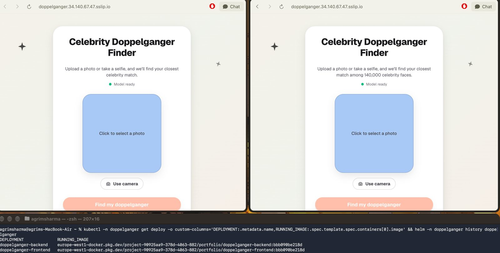

The workflow only runs while a cluster exists: `up-gcp.sh` sets the repo variables it needs and `down-gcp.sh` removes them. The AKS workflow follows the same pattern.

## Run it

**Locally** (needs the data under `data/`, which isn't in the repo; see *Privacy & data*):

```bash
pip install -r backend/requirements.txt
uvicorn backend.app:app --port 8787        # first run downloads the insightface buffalo_l model

cd frontend && npm install && npm run dev  # http://localhost:3000
```

**Tests** (no model or dataset needed):

```bash
pip install -r backend/requirements-dev.txt && pytest backend/tests
```

**Kubernetes:**

| Target | Command |
|---|---|
| Local (kind) | `./infra/local/kind-up.sh`, then `helm install` with `infra/helm/doppelganger/values-kind.yaml` |
| GKE | `infra/terraform/terraform.tfvars` with `project_id`, then `./infra/session/up-gcp.sh` (and `down-gcp.sh`) |
| AKS | `infra/azure/terraform.tfvars`, then `./infra/session/up.sh` (and `down.sh`) |

**Free hosting** (Modal + Vercel): see [deploy/FREE_TIER.md](deploy/FREE_TIER.md).

**Rebuilding the index** from the embeddings:

```bash
python scripts/clean_label_noise.py        # -> data/processed/consolidated_clean/
python scripts/evaluate_retrieval.py --index data/processed/consolidated_clean
python scripts/calibrate_real_faces.py --images data/raw/ffhq/images   # -> backend/calibration.json
python scripts/package_index.py            # -> data/deploy/index/ (what the backend serves)
```

## Privacy & data

- **Uploads:** decoded and embedded in memory only. Nothing is written to disk or logged, and the embedding is discarded after the request.
- **Head scan:** the landing page's particle head is sampled from "Infinite, 3D Head Scan" by Lee Perry-Smith (Infinite Realities), [CC BY 3.0](https://creativecommons.org/licenses/by/3.0/), via the three.js examples (`scripts/build_head_points.py`). Only the derived point cloud ships.
- **Live selfie:** the camera stream stays in the browser. A frame is captured only when you press "Take photo", and the camera is released straight away.
- **Dataset:** [IMDB-WIKI](https://data.vision.ee.ethz.ch/cvl/rrothe/imdb-wiki/) is licensed for **academic research only**. That's why the dataset, embeddings and thumbnails are gitignored, never baked into an image, and served from private storage.
- **Calibration faces:** [FFHQ](https://github.com/NVlabs/ffhq-dataset) (NVIDIA, CC BY-NC-SA 4.0), used only to compute score percentiles. No FFHQ images are stored in the repo or the deployment.
- **Scope:** a non-commercial demo.

## Repo layout

```
backend/            FastAPI matcher, calibration.json, Dockerfile, tests
frontend/           Next.js 16 + React 19 + Tailwind v4 + Framer Motion, camera capture
deploy/             free tier: Modal app + setup guide
infra/terraform/    GKE: VPC, cluster, Artifact Registry, GCS, Workload Identity, GitHub federation
infra/azure/        the same on AKS
infra/helm/         chart: backend, frontend, ingress, HPA, ServiceMonitor, Grafana dashboard
infra/session/      one-command up/down for the full GKE or AKS environment
infra/loadtest/     k6 script + in-cluster Job
infra/local/        kind cluster
scripts/            embedding, dedup, cleaning, evaluation, calibration, packaging
notebooks/          Vast.ai GPU embedding notebook
docs/               PRD, technical design, build plan, screenshots
reports/            evaluation + cleaning results (JSON)
```

## Known limitations

- 74% of identities have a single photo, which can't be cross-checked. 3,733 of them come from IMDb and may be mislabeled.
- Match strength ranks how *close* a match is, not whether a human would call it a lookalike. There's no user study.
- IMDB-WIKI skews toward Western film and TV figures, so matches are weaker for groups it underrepresents. This hasn't been measured.
